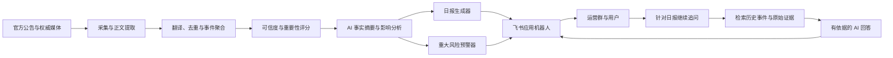

# 跨境电商飞书情报智能体设计

## 文档状态

- 状态：已确认，待用户书面复核
- 日期：2026-07-20
- 目标用户：跨境电商卖家及运营团队
- 推送范围：Amazon、TEMU、SHEIN、AliExpress、Shopee、eBay、Coupang、Ozon、Joybuy、TikTok Shop，覆盖全球站点

## 1. 问题陈述

跨境电商运营团队需要同时跟踪多个平台、站点和语言的信息。现有工作依赖人工浏览公告、卖家后台、邮件与行业媒体，容易产生三个问题：信息重复、重大政策漏报、看到资讯后不知道应采取什么行动。

本项目要解决的问题是：如何让跨境电商运营团队在五分钟内掌握全球平台的重要变化，不漏掉重大风险，并获得可以直接执行的建议。

## 2. 推荐方向

建设“全球跨境平台运营决策助手”，而不是单纯的新闻摘要机器人。第一版提供：

- 每天北京时间 09:00 的全球综合日报；
- 重大政策、违规、封店、费用和合规风险的即时预警；
- 官方公告和权威行业媒体的多语言采集、翻译、去重与事件聚合；
- 事实摘要、影响判断和行动建议；
- 飞书群聊或单聊中的后续追问；
- 原始来源、覆盖状态和采集异常的透明展示。

产品第一阶段向所有用户发送同一份全球综合日报，不提供按群、成员、类目或站点配置的个性化订阅。

## 3. 设计原则

1. 原文先入库，事件再聚合，AI 最后分析。
2. 事实、AI 判断、行动建议和不确定性必须分开表达。
3. 重要性与可信度分别评分，不用单一分数混合两者。
4. 重大预警必须能回溯到官方依据。
5. 来源未接入或采集失败时必须显示覆盖异常，不能显示“无更新”。
6. 采用最小权限，不读取与用户主动提问无关的群聊内容。
7. 第一版保持单体架构，避免过早引入微服务、复杂队列和管理后台。

## 4. 总体架构



### 4.1 信息源注册中心

维护平台、站点、语言、来源类型、入口地址、采集方式、采集频率、可信等级和健康状态。只有经过审核的官方来源和权威媒体可以启用。

### 4.2 采集管道

按来源能力依次采用官方 API、RSS/Atom、Sitemap、公开网页、授权邮件和人工提交。需要 JavaScript 渲染的公开页面可以使用浏览器渲染。不得绕过验证码、登录保护或访问限制。

### 4.3 情报处理引擎

完成语言识别、中文翻译、正文清洗、内容哈希、相似内容召回和事件聚合。同一政策的不同语言、不同站点镜像或多家媒体报道最终聚合成一个事件，但每个原始证据仍单独保存。

### 4.4 评分与风险引擎

规则引擎处理确定性条件，如来源等级、生效时间和站点范围；AI 处理语义分类、影响判断和建议生成。AI 不能单独决定重大预警。

### 4.5 AI 分析层

DeepSeek 使用 OpenAI 兼容接口：

```text
Base URL: https://api.deepseek.com
Model: deepseek-v4-pro
```

第一版全部使用 `deepseek-v4-pro`。数据量扩大后，可用 `deepseek-v4-flash` 处理翻译和初步摘要，只将高风险事件与复杂问答路由到 Pro。

### 4.6 推送调度器

北京时间每天 09:00 生成前一日 09:00 至当日 09:00 的综合日报。高风险事件达到即时预警条件后独立发送，并在次日日报中再次汇总。所有推送使用幂等键防止重复发送。

### 4.7 飞书交互层

采用企业自建应用机器人和消息卡片。机器人支持群聊中被 `@` 后回答，也支持单聊提问。耗时的 AI 处理进入后台任务，事件接收处理器只负责校验、入队和快速确认。

机器人首次进入测试群后，由管理员发送 `@机器人 绑定本群 <绑定码>`。绑定码只保存在服务端环境变量中，验证通过后系统保存事件中的 `chat_id`，并将该群设为唯一日报目标。重新绑定需要再次提供绑定码，避免误投递；这种方式无需额外申请群成员管理权限。

已确定的最小飞书权限：

- `im:message:send_as_bot`
- `im:message.group_at_msg:readonly`
- `im:message.p2p_msg:readonly`

已确定的事件订阅：

- `im.message.receive_v1`

卡片交互在基本消息闭环跑通后增加 `card.action.trigger` 回调以及对应的 CardKit 最小权限。

## 5. 信息来源策略

### 5.1 第一优先级：公开官方来源

- Amazon Seller Central 新闻、各区域 Seller Forums 新闻公告、帮助与政策页面；
- TEMU Seller Center 可公开访问的公告、规则和企业新闻；
- SHEIN Marketplace 卖家政策、协议和集团新闻；
- AliExpress 卖家门户、规则中心和招商公告；
- Shopee 各站点 Seller Education、帮助中心和官方新闻；
- eBay Seller News、Seller Updates 和政策中心；
- Coupang Global Seller 规则与政策；
- Ozon Seller Media 和知识库；
- Joybuy 商家公开资料与京东集团新闻；
- TikTok Shop Academy、Policy Center 和 Policy Pulse。

### 5.2 第二优先级：登录后官方来源

卖家中心公告、站内信、账户健康通知、违规提醒、官方邮件和客户经理正式材料。这些来源优先通过专用邮箱自动转发和团队人工提交接入。自动登录卖家后台不属于第一版范围。

### 5.3 第三优先级：政府与监管机构

覆盖海关与关税、VAT/GST、产品安全与召回、环保和包装、数据隐私、知识产权、消费者保护、进出口限制与制裁。监管变化可以同时影响多个平台，应作为独立来源类别。

### 5.4 第四优先级：权威行业媒体

行业媒体用于提前发现线索、补充市场趋势和解释影响。找不到官方依据的政策类报道只能标记为“媒体报道，待官方确认”，不能触发已确认的重大预警。

### 5.5 趋势与机会信号

平台热销榜、类目排行、搜索趋势、广告趋势、新站点招商、物流运价和季节性数据用于“机会雷达”。这些内容必须标记为趋势信号，不能包装为确定性选品结论。

### 5.6 覆盖状态

日报按平台和站点显示以下状态之一：

- 官方公开来源已覆盖；
- 公开来源已覆盖，卖家中心待接入；
- 部分站点已覆盖；
- 数据源异常；
- 暂未接入。

第一版先确保十个平台均出现在来源注册表和日报覆盖区，再分批扩大每个平台的站点和来源深度。

## 6. 数据模型

### `sources`

平台、站点、语言、URL、来源类型、可信等级、采集方式、采集频率、启用状态。

### `documents`

原始标题、正文、发布时间、采集时间、原始链接、内容哈希、语言、原始快照位置。

### `events`

聚合后的主题、平台、站点、类目、事件类型、生效时间、重要性、可信度和当前状态。

### `evidence`

事件与原始文档的多对多关系，以及每份证据对事实字段的支持范围。

### `analyses`

事实摘要、影响判断、行动建议、不确定项、模型名称、提示版本和生成时间。

### `reports`

日报统计周期、事件集合、生成状态、版本和最终卡片内容。

### `deliveries`

目标会话、消息类型、幂等键、飞书消息 ID、发送时间、状态、重试次数和失败原因。

### `conversations`

用户问题、关联事件、检索证据、回答内容和飞书消息 ID。

### `source_health`

最后成功时间、连续失败次数、最近错误、解析结果数量和告警状态。

原始文档和证据关系不得被 AI 生成内容覆盖或删除。

## 7. 日报与预警

### 7.1 日报结构

1. 今日必看：最多 3 至 5 条；
2. 风险预警：账户、合规、费用、商品、物流；
3. 机会雷达：站点扩张、类目趋势、平台活动；
4. 平台动态：按十个平台分组；
5. 今日行动清单；
6. 数据概况：采集来源数、有效事件数、异常来源数和覆盖状态。

没有重要变化的平台显示“今日无重要更新”；来源未接入或采集异常的平台显示真实覆盖状态。

### 7.2 情报卡片结构

- 标题；
- 平台、站点和类目；
- 重要性和可信度；
- 已确认事实；
- AI 影响判断；
- 建议行动；
- 生效时间；
- 原始来源。

### 7.3 重要性评分

- 影响程度：30%；
- 影响卖家范围：25%；
- 时间紧迫性：20%；
- 潜在损失：15%；
- 日常运营相关度：10%。

分级规则：

- 90 至 100：立即预警，并在日报汇总；
- 75 至 89：进入今日必看；
- 60 至 74：进入平台动态；
- 低于 60：入库但不进入主日报。

政策在 72 小时内生效且影响较大时提升一级。

### 7.4 可信度评分

- 官方原始公告：最高等级；
- 官方公告与权威媒体相互印证：已确认；
- 单一权威媒体：基本可信；
- 来源矛盾或缺少原文：待确认。

“待确认”内容不得触发已确认的重大预警。

## 8. AI 输出契约

DeepSeek 必须输出可校验的结构化 JSON。至少包含：

```json
{
  "title_zh": "中文标题",
  "platforms": ["Amazon"],
  "sites": ["US"],
  "categories": [],
  "confirmed_facts": [],
  "impact_analysis": "AI 影响判断",
  "recommended_actions": [],
  "effective_at": null,
  "importance_score": 0,
  "confidence_level": "unconfirmed",
  "uncertainties": [],
  "evidence_ids": []
}
```

约束：

- 不得虚构生效时间、站点或适用类目；
- 每项事实必须绑定证据；
- 推测必须放入影响判断或不确定项；
- 原文没有行动要求时，建议不能表述为平台强制要求；
- 日期、数字或政策描述冲突时停止自动预警，进入人工复核；
- JSON 校验失败时自动重试一次，仍失败则采用规则模板降级。

## 9. 安全与密钥

- 飞书 App Secret 和 DeepSeek API Key 只保存在服务端环境变量或密钥管理服务中；
- `.env`、数据库文件和日志不进入 Git；
- 日志不得记录令牌、完整请求头或用户敏感信息；
- 用户曾在聊天中发送的测试 Key 视为已泄露，不用于系统配置；
- 飞书仅申请完成产品功能所需的最小权限；
- 不采集未授权的卖家后台数据，不绕过平台访问保护。

## 10. 异常处理与可观测性

- 采集失败：指数退避重试，连续失败后向管理群告警；
- 页面结构变化：标记解析异常，不把空内容当成无更新；
- 内容重复：通过内容哈希、语义相似度和事件字段聚合；
- 证据冲突：暂停自动推送并进入人工复核；
- DeepSeek 不可用：保留原始标题与来源，延后补充 AI 分析；
- 飞书发送失败：保存待发送记录并重试；
- 日报生成与发送：使用统计周期和目标会话生成幂等键；
- 来源健康：记录最后成功时间、连续失败次数、解析数量和异常原因。

第一版的人工复核项写入数据库并通过维护命令查看、批准或驳回，不建设管理后台。未完成复核的内容不会进入即时预警。

## 11. MVP 技术方案

- Python；
- FastAPI；
- APScheduler；
- 飞书官方 Python SDK，使用 WebSocket 长连接；
- DeepSeek OpenAI 兼容接口；
- 本地开发使用 SQLite；
- 正式部署使用 PostgreSQL；
- 单体应用部署在持续运行的云服务器或云容器。

第一版不引入 Redis、Celery、微服务或独立搜索集群。只有在任务量、并发或可靠性指标证明有需要后再升级。

生产 MVP 使用单个应用实例和单个调度器，避免 APScheduler 在多进程部署中重复执行日报任务。需要横向扩容时，必须先增加分布式锁或独立调度器。

## 12. 测试与验收

### 自动测试

- 采集器解析测试；
- 内容哈希与重复检测测试；
- 跨语言事件聚合测试；
- 重要性和可信度规则测试；
- AI JSON 契约校验测试；
- 日报幂等测试；
- 飞书与 DeepSeek 客户端的模拟集成测试。

### 端到端测试

- 向测试群发送一份完整日报；
- 群内 `@机器人` 询问某条政策的影响；
- 单聊追问并验证回答引用原始证据；
- 模拟来源失败、DeepSeek 超时和飞书发送失败；
- 验证高风险事件即时预警且不重复发送。

### 验收标准

1. 同一政策的多语言报道能合并为一个事件；
2. 每条事实都能打开原始来源；
3. AI 不确定时明确标注，不编造日期或站点；
4. 每天 09:00 只发送一份日报；
5. 高风险事件可独立预警且不重复；
6. 机器人能根据日报证据回答追问；
7. 单个来源失效不会阻塞整份日报；
8. DeepSeek 或飞书短暂失败后能够重试；
9. 日报能在五分钟内读完；
10. 数据覆盖异常明确展示。

## 13. MVP 范围

### 包含

- 十个平台的来源注册和覆盖状态；
- 公开官方网页、权威媒体、官方邮件和人工提交；
- 多语言翻译、去重、聚合、评分和 AI 分析；
- 每日综合日报和重大风险即时预警；
- 飞书群聊与单聊问答；
- 来源追溯、发送记录和来源健康监控。

### 不包含

- 自动登录十个平台卖家后台；
- 自动选品或销量预测；
- 自动修改商品、广告或店铺设置；
- 复杂管理后台；
- 按用户、群、平台或类目的个性化订阅；
- 手机 App；
- 多企业租户、收费与套餐；
- 未经证实的论坛和社交传言。

## 14. 关键假设与验证方式

- 假设运营团队愿意每天阅读统一综合日报。通过阅读率、追问次数和五分钟访谈验证。
- 假设公开来源、官方邮件和人工提交足以验证核心价值。通过连续四周的重大政策回溯检查漏报。
- 假设结构化行动建议比普通摘要更有价值。记录行动清单点击、追问和团队采纳情况。
- 假设单体架构可以支持初期数据量。监控采集耗时、任务积压和数据库响应时间。

## 15. 成功指标

- 重大官方政策在已覆盖来源范围内尽量零漏报；
- 日报阅读时长不超过五分钟；
- 每条重点事件都有来源、影响判断和行动建议；
- 追问回答能引用对应证据；
- 统计日报阅读、追问、行动采纳和来源异常；
- 每周人工回顾误报、漏报和低价值内容并调整评分规则。

## 16. 参考资料

- 飞书机器人概述：https://open.feishu.cn/document/uAjLw4CM/ukTMukTMukTM/bot-v3/bot-overview
- 飞书卡片概述：https://open.feishu.cn/document/feishu-cards/feishu-card-overview
- 飞书长连接接收事件：https://open.feishu.cn/document/server-docs/event-subscription-guide/event-subscription-configure-/request-url-configuration-case
- DeepSeek API：https://api-docs.deepseek.com/zh-cn/
- Amazon Seller Forums：https://sellercentral.amazon.com/seller-forums
- eBay Seller News：https://export.ebay.com/en/resources/seller-news/
- TikTok Shop Policy Pulse：https://seller-us.tiktok.com/university/essay?default_language=en&identity=1&knowledge_id=7096334743553838
- Coupang Rules and Policies：https://globalsellers.coupang.com/en/rules-and-policies/
